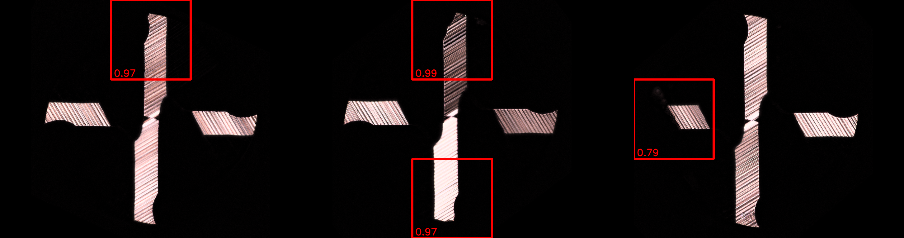
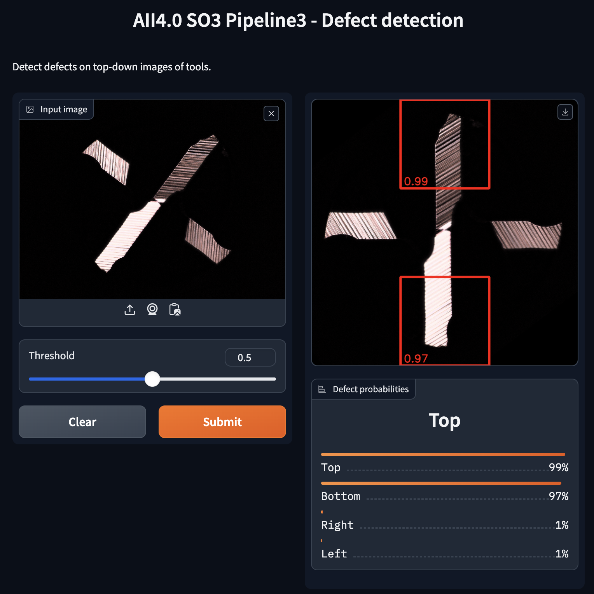
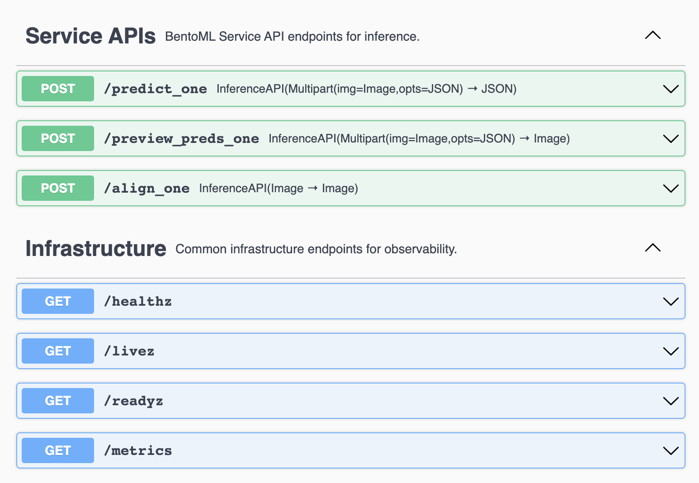

<h1>AII40-SO3-PIPELINE3</h1>

- [Introduction](#introduction)
- [About](#about)
  - [Tools and Libraries](#tools-and-libraries)
  - [Data](#data)
  - [Stages](#stages)
- [Pre-requisites](#pre-requisites)
- [Installation](#installation)
  - [With Poetry](#with-poetry)
  - [With pip](#with-pip)
    - [With CUDA](#with-cuda)
    - [Without CUDA](#without-cuda)
- [Usage](#usage)
  - [View Logs](#view-logs)
  - [Demo](#demo)
    - [Running the demo](#running-the-demo)
    - [Building the demo](#building-the-demo)
  - [API](#api)
    - [Running the API](#running-the-api)
    - [Building the API](#building-the-api)
- [Data](#data-1)
- [Contributing](#contributing)
  - [Install pre-commit hooks](#install-pre-commit-hooks)

## Introduction

This is a pipeline for the AII40-SO3 project. It is a pipeline that is used to train a model that can be used to predict the defects in a given image.



## About

### Tools and Libraries

- [DVC](https://dvc.org/doc/start)
- [PyTorch](https://pytorch.org/)
- [PyTorch Lightning](https://lightning.ai/pytorch-lightning/)

### Data

The data is located in the `data/datasets` directory.

### Stages

The pipeline has the following stages:

- `prepare`
- `train`
- `evaluate`
- `export`

## Pre-requisites

- Python>=3.8
- [Poetry](https://python-poetry.org/docs/#installation)

## Installation

### With Poetry

```bash
# Install the dependencies
poetry install
# Activate the virtual environment
poetry shell
```

> **Note**  
> Poetry has some compatibility issues with PyTorch and CUDA. If you encounter any issues, please use pip instead.

### With pip

```bash
# Create a virtual environment
python3 -m venv .venv
# Activate the virtual environment
source .venv/bin/activate
```

The pipline can run on both CPU and GPU. You can install the dependencies with or without CUDA support:

#### With CUDA

```bash
pip3 install -r requirements/requirements-dev-cuda.txt \
  --extra-index-url https://download.pytorch.org/whl/cu118
```

#### Without CUDA

```bash
pip install -r requirements/requirements-dev.txt
```

## Usage

First, run the pipeline with the following command:

```bash
dvc repro
```

This will create the following directories:

- `lightning_logs` - contains the logs of the model
- `out/prepared` - contains samples of the input data
- `out/train` - contains the trained model weights
- `out/evaluation` - contains the evaluation metrics and plots (confusion matrix and ROC curve)
- `out/exported` - contains the exported model in ONNX format

### View Logs

To view the logs of the model, run the following command:

```bash
tensorboard --logdir=lightning_logs
```

### Demo

#### Running the demo

To run the live demo, run the following command:

```bash
python3 -m src.demo --share
```

This will run a server accessible to the internet through port tunneling.

#### Building the demo

To build the demo, run the following command:

```bash
docker build -t defect_detection_demo:latest -f docker/Dockerfile .
```

To run the demo, run the following command:

```bash
docker run -it --rm -p 7860:7860 defect_detection_demo:latest
```

A preview of the demo is shown below:



### API

#### Running the API

To run the API, run the following command:

```bash
bentoml serve src.service:svc
```

#### Building the API

To build the API, run the following commands:

```bash
bentoml build
bentoml containerize onnx_defect_detection_api:latest
```

To run the API, run the following command:

```bash
docker run --rm -p 3000:3000 onnx_defect_detection_api:<TAG>
```

A preview of the API is shown below:



## Data

Currently as the data is limited, it is difficult to accurately test and evaluate the model. Below is an example of predictions made by the model on the validation set:


## Contributing

### Install pre-commit hooks

```bash
pre-commit install
```
